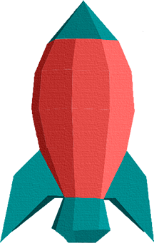

# Lunar_LanderHTML-CSS-master1

Proyecto del videojuego **Lunar Lander** escrito en html y CSS.
Autor: Pau Vidal 

## Documentación:

### Descripción del proyecto:
Crear el estilo visual con html y CSS de un videojuego para navegador cuyo objetivo es el de aterrizar una nave en la superficie lunar.

### cambios visuales respecto al StoryBoard original:
* Los botones del menú estan un poco más compactos.
* En la versión movil, los bocadillos apuntan a la derecha y a la izquierda en vez de los dos a la derecha.

### Elementos que aparecen en el documento:

* Nave: Sprite principal. En un futuro el jugador interactuará con la nave para poder jugar a este videojuego.
* Bocadillos. Estan a los lados de la nave (disposicion horizontal) o a un solo lado de la nave (disposicion vertical). Mostrarán información relativa a la altura y velocidad de la nave.
* Combustible. Da información sobre el nivel de la gasolina actual de la nave. Está ubicado en el centro de la nave.
* Superficie lunar. Zona donde aterrizará la nave.
* Menú. Compuesto por tres botones (pausa/reanudar; reinicio; información). Cada uno tiene una funcion distinta.
* Fondo. Es un fondo de estrellas. Es un elemento decorativo.
* Mundo. Es un añadido al fondo, pero sin ser parte de el. Es un elemento decorativo.
* Boton "PUSH". De momento es un elemento sin ninguna funcion. Póximamente tendá la funcion de simular un botón con el que la nave se activará.

 Desde el documento que he recibido, estaban ausentes:
* Instrucciones de como crear las etiquetas HTML. 

#### HTML:
* La nave, los bocadillos y el indicador de fuel cuentan con un contenedor que cubre el 100% del tamaño de la pantalla en horizontal. El indicador de fuele está encima de la nave.
* El menú se compone de un contenedor con las tres imágenes de los botones dentro. Cada boton es un link a una página distinta: el boton de pausar es un link a la página donde se escribirán las instrucciones del juego; el botón de reinicio es un link a la misma página; el botón de información un link a la misma página del juego.
* La luna se compone de un solo contenedor con una anchura de 100% al ser una imagen con base plana.
* La imagen del mundo está en un contenedor, independientemente de la imágen del fondo.
* El botón "PRESS" está en un contenedor dentro del contenedor de la luna. 

#### CSS (Estilo horizontal)

* La nave está centrada en el contenedor junto a los dos bocadillos que están a los lados. Estos bocadillos tienen un padding para que estén al lado izquierdo y derecho de la nave respectivamente. 
* La imagen de la luna tiene una anchura igual a la del contenedor para que ocupe el 100% del espacio horizontal.
* El botón "PRESS" está agrandado para que ocupe un alto y ancho mayor, si no quedaba demasiado pequeño.
* El indicador de fuel está puesto enmedio y encima de la nava para con los atributos "top" y "left". Al mismo tiempo se ha modificado el tamaño de este para que encajara dentro de la nave.
* Los botones del menú estan reducidos de tamaño para poder quedarse en el lado izquierdo de la pantalla sin que se interpongan con el resto de elementos. Estan puestos de manera horizontal.

#### CSS (Estilo vertical)

* Los bocadillos pasan a estar los dos en el lado izquierdo de la nave en vez de estar en ambos lados.
* Los los botones ahora pasan a estar de manera vertical para poder aprovechar mejor el espacio vertical que supondría un móvil.
* Se ha ajustado los valores de la nave y fuel para que no ocupen demasiado espacio en una pantalla vertical.
 
